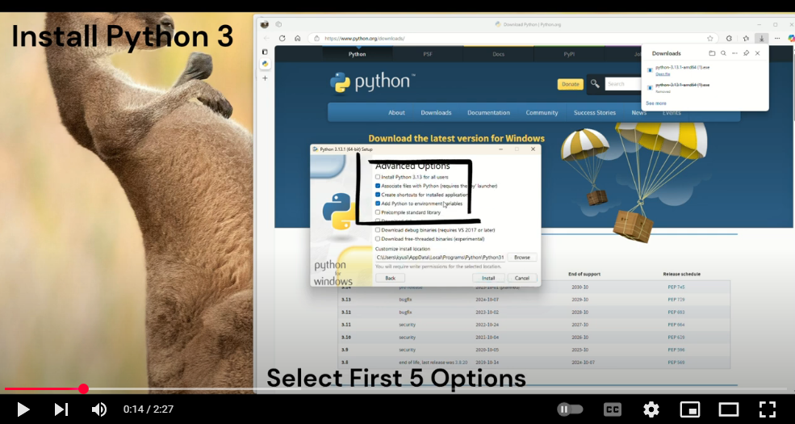
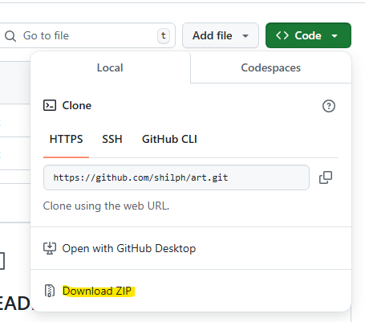
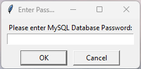
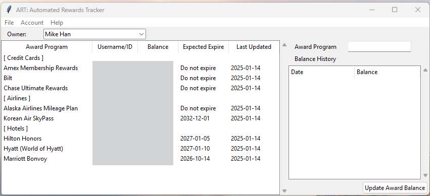
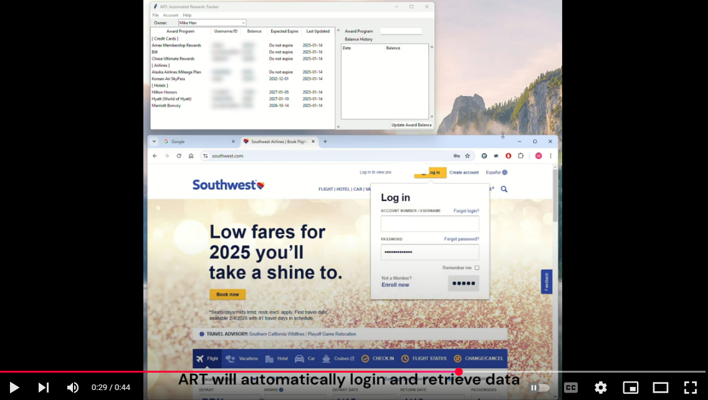

# ART: Automated Rewards Tracker


## What is ART?
<code style="color : Orangered">ART</code> is a Python-based GUI application designed to gather the current reward balances automatically for travel rewards programs, such as credit cards, hotels, and airlines.


### Features

- <code style="color : Orangered">Automated Login</code> ART uses the Chrome browser to automatically log in to the accounts and retrieve the current points balance.

- <code style="color : Orangered">Point Expiration Calculation</code> ART calculates (or detects) the estimated date of point expiration for each reward program. 

- <code style="color : Orangered">Local Tracking</code> ART is not a web service, so all tracking is done on the user's desktop, reducing the risk of massive data breaches.

- <code style="color : Orangered">Secure Storage</code> All information (username, password, and current points balance) is stored on a local MySQL database, protected by password-protected MySQL authentication.

- <code style="color : Orangered">Privacy</code> No personal information is shared or sold, ensuring complete privacy and security.

- <code style="color : Orangered">Cross-Platform Compatibility</code> Runs on Windows, Linux (not tested yet), and macOS (not tested yet). (Sorry I have Windows systems only. `:cry:` )

With ART, users can easily track their rewards and ensure they never miss out on valuable points.

## Why I developed ART?


There is a paid-subscription service, [AwardWallet](https://awardwallet.com/), which I used for several years at a grandfathered price of \$10/year. It was one of the best subscription services I ever had, despite AwardWallet discontinuing tracking for a few reward programs, such as AA and Southwest.

Unfortunately, AwardWallet decided not to honor the grandfathered service since mid-November 2024, raising the price to \$50/year. This 400% price increase, along with the uncertainty of which rewards programs might be discontinued in the future, led me to start ART, an open source project to track rewards programs for the long term plan.

## Getting Started

### Dependencies

* [Python 3](https://www.python.org/downloads/)
  * Additional Python libraries
    * [Playwright for Python](https://pypi.org/project/playwright/)
    * [MySQL Connector for Python](https://pypi.org/project/mysql-connector-python/)
    * [beautifulsoup](https://pypi.org/project/beautifulsoup4/)
    * [requests](https://pypi.org/project/requests/)
    * [dateutil](https://pypi.org/project/python-dateutil/)
* [MySQL (Community version)](https://dev.mysql.com/downloads/)
  * For Windows user, please use [MySQL Installer for Windows](https://dev.mysql.com/downloads/windows/)
* [Google Chrome](https://www.google.com/chrome/bsem/download/en_us)
  * ART uses Chrome DevTools Protocol to control the Chrome browser to track rewards programs automatically.

### Installation
1. Install all Prerequisites 
   1. [How to install Python 3 on YouTube]((https://www.youtube.com/results?search_query=how+to+install+python+3))
   2. [How to install MySQL](https://www.youtube.com/results?search_query=how+to+install+mysql+community+server)
      1. Please use a strong password while installing MySQL. All your usernames and passwords will be installed on MySQL database.
   3. To install additional Python libraries
      1. **Playwright:** _pip install playwright_
      2. **MySQL Connector:** _pip install mysql-connector-python_
      3. **beautifulsoup:** _pip install beautifulsoup4_
      4. **requests:** _pip install requests_
      5. **dateutil:** _pip install python-dateutil_
      
[](https://www.youtube.com/watch?v=3Rd9kUrtLkY)
> [!NOTE]
> Please follow the video to install prerequisites.

2. Download entire ART package or clone it.
   1. 

## How to use

Go to the directory where you download/clone ART
```commandline
python art.py
```

If you successfully launch ART, you will be able to see a popup window to enter MySQL password as below.  



Once you successfully enter the valid MySQL password, Chrome and ART main window will be launched.

> [!WARNING]
> 
> If a Chrome browser window previously launched by ART is open, please ensure it is closed.
> 
> Additionally, DO NOT close the Chrome browser while using ART.



If this is the first time use, please add a user first. 

> [!WARNING]
> 
> Please ensure that you close the Chrome browser window launched by ART once you have completed using the application.


### How to Add a User

1. Go to _Account_ > _Add a User_.

### How to Add a Reward Program

1. Go to _Account_ > _Add an Award_. 
2. Select a reward program and enter required information.
3. If all information is correct, ART will automatically log in to the reward program and retrieve the current balance.

[](https://www.youtube.com/watch?v=TxCPN58r_JY)

Please watch the video how it works.

### How to Update the Current Balance of a Reward Program

1. Select a reward program then click _Update Award Balance_.

## Which Reward Programs ART Currently Supports?

### Credit Cards
- [x] Chase Ultimate Rewards
- [x] American Express Membership Rewards
- [ ] Citi ThankYou Points (I do not have Citi credit card which earns ThankYou Points.)
- [ ] Capital One Miles (I do not have Capital One credit card which earns Miles.)
- [x] Bilt Rewards

### Hotels
- [x] Hyatt World of Hyatt
- [x] Marriott Bonvoy
- [x] Hilton Honors
- [x] IHG One Rewards
- [ ] Choice Privileges
- [ ] Wyndham Rewards

### Airlines
- [x] Delta Airlines SkyMiles
- [x] United Airlines Mileage Plus
- [x] American Airlines AAdvantage miles
- [x] Alaska Airlines Mileage Plan
- [x] Southwest Airlines Rapid Rewards
- [ ] Jetblue Airlines TrueBlue
- [x] Korean Airlines SkyPass
- [x] Avianca Airlines LifeMiles
- [ ] British Airways Executive Club (Avios)
- [ ] Virgin Atlantic Flying Club

> [!NOTE]
> I will add more rewards programs later.

## Support ART. Support Me.

Hello, world! My name is Mike, and I’m the main developer behind <code style="color : Orangered">ART</code> (Automated Rewards Tracker).

ART is an open-source project designed to track travel-related rewards programs. When I first introduced ART to my friends and family, they naturally wondered about the monetary gains it might bring. However, as a passionate software engineer, my true joy lies in sharing my skills and knowledge. That’s why ART is freely available to all, without the constraints of a paid subscription.

But here’s where I need your help. In November 2024, after dedicating 17 and a half years at Intel, my career took an unexpected turn. Along with most of my team members, I was impacted by a shift in operations to lower-cost geographies. While I am earnestly searching for a new position to expand my career and support my family, I haven’t had much luck yet.

This is where you come in. If you appreciate the value that ART brings to the community, I humbly ask for your support. You can directly help me continue this project by visiting my [Ko-fi](https://ko-fi.com/projectart) account for donations. Every bit of support helps, especially as I navigate this challenging time without a stable source of income.

Additionally, if you have any leads or connections, please check my [LinkedIn profile](https://www.linkedin.com/in/mike-han-4112b86/) and consider helping me find a new role. Together, we can keep ART thriving and support the spirit of open-source innovation.

Thank you for your generosity and belief in the potential of ART. Your support means the world to me and my family.

Warmest regards,

Mike (shilph)


[](https://ko-fi.com/H2H719F5SL)